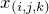
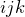

# Homework 3
> **[Jio Gim](mailto:jio.gim@postech.edu)**, Creative IT Engineering, POSTECH  
> **Student ID:** 20160087, **Povis ID:** iknowme

## How I used CNF to solve E/O Sudoku game

Sudoku Board

#### Value Mapping
In my solver (named "SUDOKUS"),  which means whether if th row th column has value  is mapped to . For example, when  is true, the cell of th row th column should have a value of .

#### CNF Making
Below items are conjuncted.  
  + **All possibilities for an empty cell**  
    For all empty cells, add condition of its all possibilities. For instance, in the cell of th row th column on right figure, the number , , , ,  cannot be in there. So in this case, the condition  will be included to the CNF sentence. In this phase, Even/Odd Sudoku rules are also applied.  
  + **Basic Sudoku rules**  
    There're three major rule:  to  in each sub-grid, in each column, and in each row. This can be expressed in CNF as below.
      - Sub-grid level  
        
      - Row level
        
      - Column level
        

## Development Notes
+ **DO NOT USE** Lombok → It does not supports Java 10.
